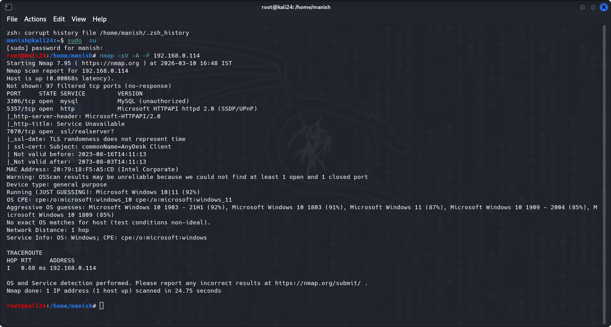
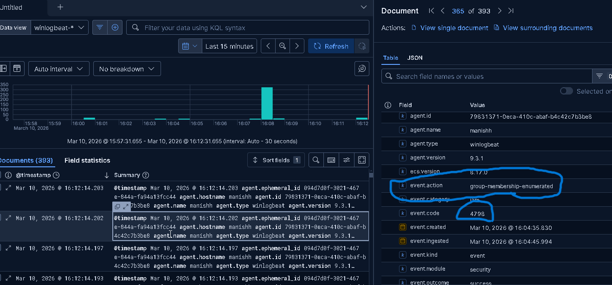
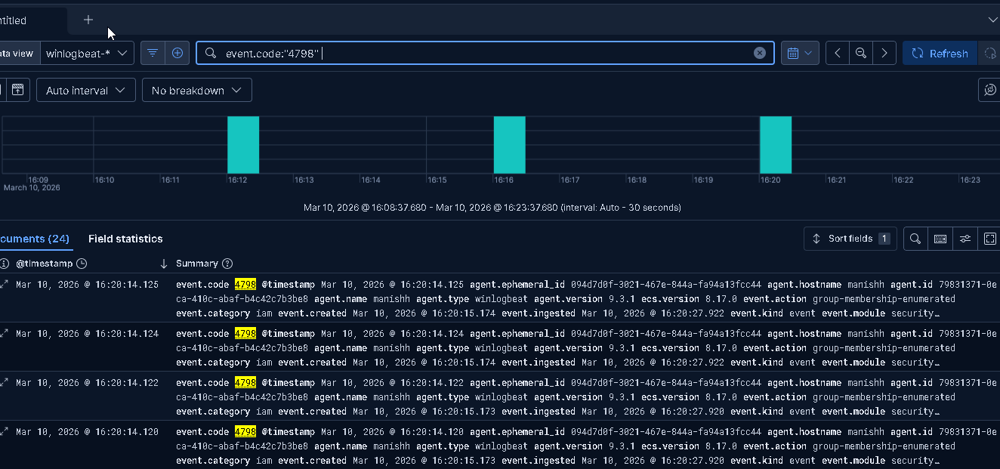
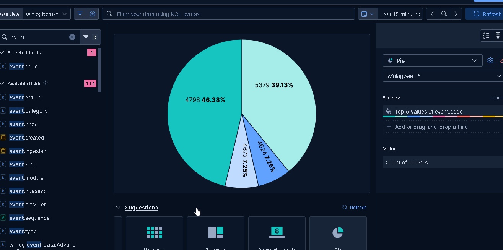

# nmap_Detection_On_ELK
A mini-SIEM project demonstrating Nmap scan detection using the ELK Stack. This project uses Logstash to ingest network logs, Elasticsearch to index scanning patterns


# 🔍 Nmap Scan Detection Using ELK Stack (SIEM Lab)


---

## 📌 Project Overview

This project demonstrates how to detect **Nmap network scans** using the **ELK Stack (Elasticsearch, Logstash, Kibana)** as a SIEM solution. The detection was achieved by monitoring **Windows Security Event ID 4798**, which is triggered during local group membership enumeration — a common behavior observed during Nmap host/service discovery scans.

This lab simulates a real-world SOC analyst workflow:
- Attacker launches an Nmap scan from a **Kali Linux** machine
- Logs are collected and forwarded to the **ELK Stack**
- The SOC analyst detects and investigates the scan through **Kibana dashboards**

---

## 🛠️ Lab Environment

| Component        | Details                                        |
|------------------|------------------------------------------------|
| Attacker Machine | Kali Linux                                     |
| Target Machine   | Windows (with Winlogbeat/Sysmon)               |
| SIEM Platform    | ELK Stack (Elasticsearch + Logstash + Kibana)  |
| Detection Method | Windows Event ID 4798                          |
| Network Setup    | Host-Only / Internal Network                   |

---

## 🎯 What is Event ID 4798?

**Event ID 4798** — *"A user's local group membership was enumerated"*

This event is logged by Windows Security when a process enumerates the local group membership of a user account. Nmap, during host and service discovery, triggers this event as part of its scanning activity — making it a reliable indicator of reconnaissance behavior.

> **Why it matters:** Attackers commonly use Nmap in the early stages of an attack (Reconnaissance phase of MITRE ATT&CK: **T1046 - Network Service Discovery**).

---

## ⚔️ Step 1 — Launching the Nmap Scan (Attacker - Kali Linux)

The Nmap scan was launched from the **Kali Linux** attacker machine targeting the Windows host on the internal network.

**Command used:**
```bash
nmap -sV -A -T4 <Target-IP>
```

**Screenshot — Nmap Scan from Kali Linux:**


*Nmap scan executed from Kali Linux targeting the Windows host*

---

## 📡 Step 2 — Log Collection & Forwarding to ELK

Logs from the Windows target machine were collected using **Winlogbeat** (or **Elastic Agent**) and forwarded to the ELK Stack pipeline.

- **Winlogbeat** monitored Windows Security Event Logs
- Logs were ingested into **Elasticsearch** via **Logstash**
- **Kibana** was used for visualization and threat hunting

---

## 🔎 Step 3 — Detecting the Nmap Scan in ELK / Kibana

After the scan was executed, the suspicious activity was visible in **Kibana Discover** by filtering for **Event ID 4798**.

**KQL Query used in Kibana:**
```
event.code: "4798"
```

**Screenshot — Nmap Scan Detected in ELK (Kibana):**



*Event ID 4798 logs detected in Kibana after Nmap scan from Kali Linux*

**Key fields observed in the logs:**

| Field              | Value / Description                              |
|--------------------|--------------------------------------------------|
| `event.code`       | 4798                                             |
| `winlog.event_id`  | 4798                                             |
| `event.action`     | User Account Local Group Membership Enumerated   |
| `source.ip`        | Kali Linux IP (Attacker)                         |
| `destination.ip`   | Windows Host (Target)                            |
| `@timestamp`       | Time of scan activity                            |

---

## 📊 Step 4 — Kibana Dashboard & Pie Chart Visualization

A **Kibana visualization (Pie Chart)** was created to show the distribution of **Event IDs** captured during the monitoring period, highlighting the spike in Event ID 4798 during the Nmap scan.

**Screenshot — Pie Chart of Event IDs in Kibana:**


*Kibana Pie Chart — Distribution of Windows Event IDs, showing spike in Event ID 4798*

---

## 🧠 MITRE ATT&CK Mapping

| Tactic         | Technique                         | ID        |
|----------------|-----------------------------------|-----------|
| Reconnaissance | Network Service Discovery         | T1046     |
| Discovery      | Account Discovery: Local Account  | T1087.001 |

---

## ✅ Key Takeaways

- **Event ID 4798** is a reliable indicator of network reconnaissance activity on Windows systems.
- ELK Stack can effectively act as a lightweight SIEM for detecting scans and enumeration attempts.
- Kibana's **KQL filtering** and **visualization dashboards** make it easy to triage and analyze suspicious events.
- This lab simulates a real **SOC Analyst L1** workflow — log ingestion → detection → investigation → visualization.

---

## 📁 Project Structure

```
nmap-detection-elk/
│
├── README.md                    ← This file
├── screenshots/
│   ├── nmapScanKali.png         ← Nmap scan from Kali Linux
│   ├── nmapScan.png             ← Detection in Kibana
│   ├── Event4798.png            ← Detection using KQL search
│   └── piechart.png             ← Pie chart of Event IDs
```

---

## 👤 Author

**Manish Ravtole**
BCA Student | Cybersecurity Enthusiast | SOC Analyst (Aspiring)

[](https://linkedin.com/in/manishravtole)
[](https://tryhackme.com/p/Cipher24)

---

*This project is part of my SOC Home Lab portfolio built using Wazuh, ELK Stack, Sysmon, and Kibana.*
